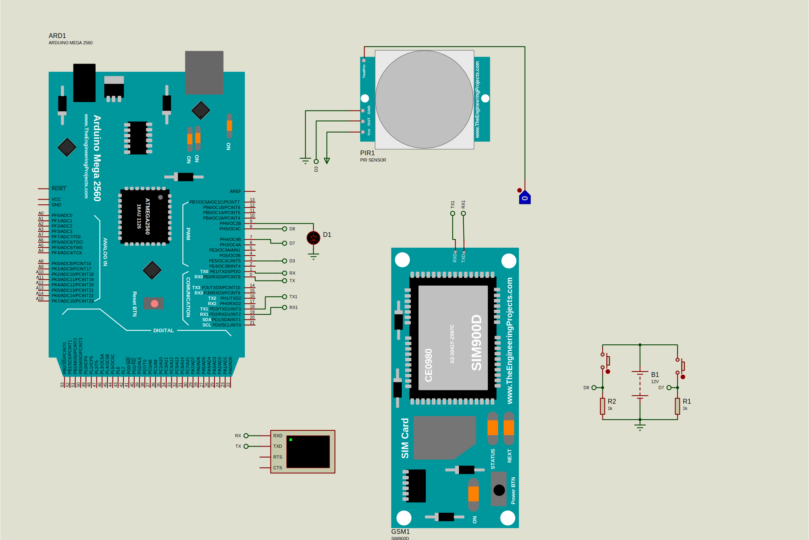

# Home-security-system

A simple arduino based project for home security with SMS based notification

## Features 

- Buzzer and LED Alam  
- Panic Button
- Door pressed detection
- LCD Display notification
- GSM based SMS Notification 
- Ultrasonic Sensor (detecting obstacles)

## How does it work ?

It sense threats and then alarm the system when any of the parameters being monitored is detected which include;

- pressing of panic button
- Opening of a door
- Proximity near by

and immediately alarm the system by raising notifications which include;

- Buzzer Alarm 
- Turning warning security LED 
- Sending a SMS Notification 
- Displaying Threat on LCD Display 

## Circuit Diagram

The first proposed model used PIR as to sense threats while the codebase relies on ultrasonic to achieve that, so replace PIR with ultrasonic in your wiring !! .

